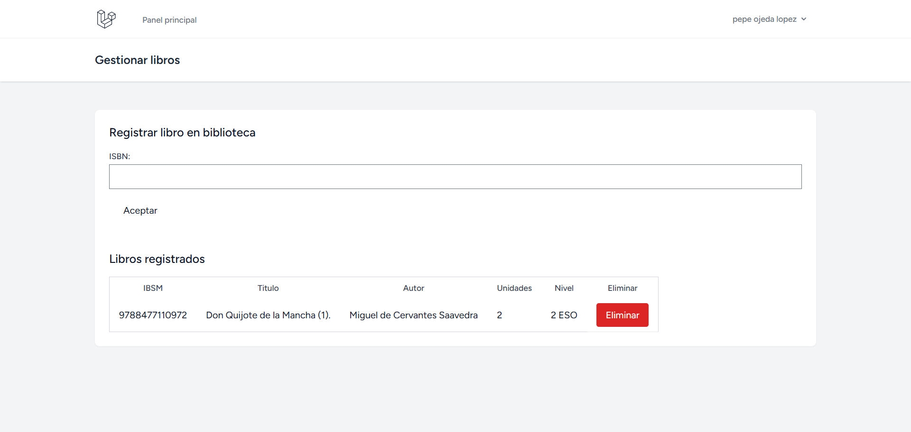
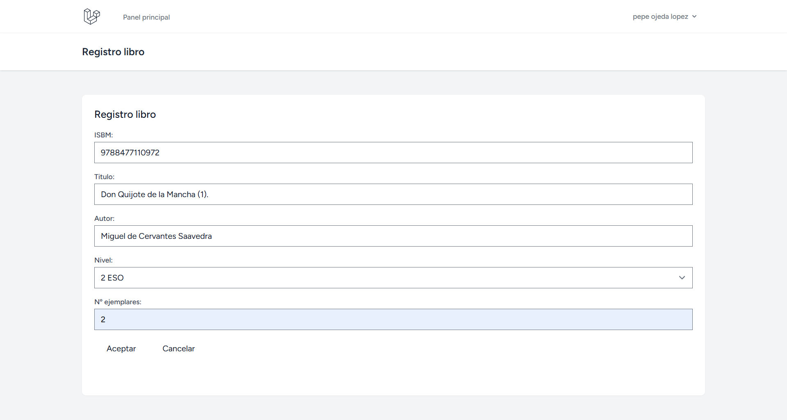
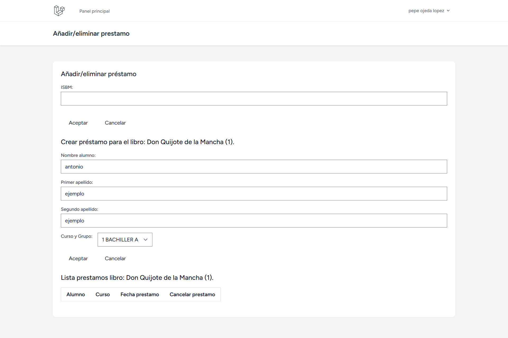
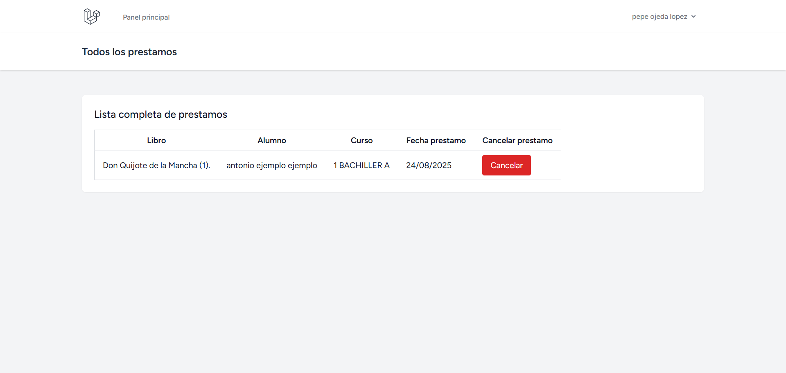
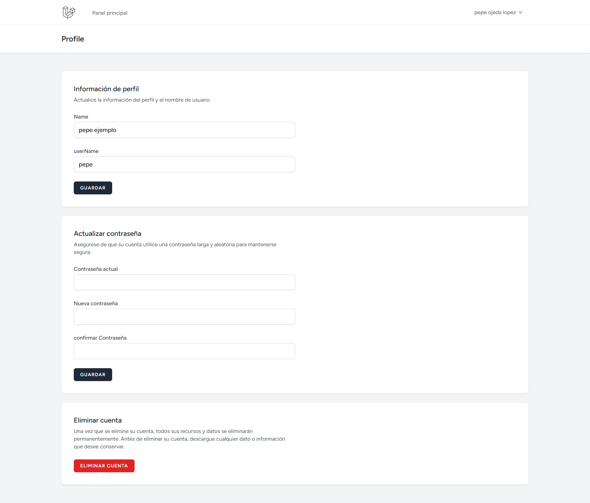

# 📚 Biblioteca Inglés – Laravel 11

Aplicación web desarrollada en **Laravel 11** para la gestión de una biblioteca escolar: administración de libros (con precarga por ISBN), gestión de préstamos y listado de préstamos, con autenticación.

---

📸 Capturas de pantalla

### 🔑 Login y Registro
<p align="center">
  
  
</p>

### 🏠 Dashboard
<p align="center">
  
</p>

### 📚 Gestión de Libros
<p align="center">
  
  
</p>

### 📖 Gestión de Préstamos
<p align="center">
    
    
</p>

### 👤 Perfil de Usuario
<p align="center">
  
</p>

---

## 🧰 Tecnologías utilizadas
- **Laravel** 11 (`laravel/framework ^11.31`), **PHP ≥ 8.2**
- **Laravel Breeze** (autenticación con Blade + Tailwind + Alpine)
- **Vite**, TailwindCSS, AlpineJS
- **Base de datos**: MySQL/MariaDB
- **API externa**: OpenLibrary (para precargar datos de libros por ISBN)

---

## 📂 Estructura funcional
- **Modelos**:
  - `Libro` (hasMany `Prestamo`)
  - `Curso` (hasMany `Prestamo`)
  - `Prestamo` (belongsTo `Libro`, belongsTo `Curso`)
- **Controladores**:
  - `GestionarLibros`: búsqueda por ISBN en OpenLibrary, registro de libros, listado y eliminación.
  - `PrestamoController`: gestión de préstamos por ISBN, alta y baja de préstamos, listado de todos los préstamos.
- **Vistas**:
  - `dashboard`, `gestionarLibros`, `registroLibro`, `isbnPrestamo`, `todosLosPrestamos`
- **JS público**:
  - `public/js/eliminarLibro.js` y `public/js/borrarPrestamo.js` (borrado vía fetch + JSON)

---

## 🔐 Autenticación
Implementada con **Laravel Breeze**.  
Incluye login, registro y perfil de usuario.  
Todas las funcionalidades están protegidas con middleware `auth`.

---

## 🗃️ Esquema de datos
- **libros**: `id`, `isbn`, `titulo`, `autor`, `num_ejemplares`, `nivel`
- **cursos**: `id`, `curso`, `grupo`
- **prestamos**: `id`, `id_libro`, `id_curso`, `fecha`, `nombre_alumno`, `apellido1_alumno`, `apellido2_alumno`  
  > Relación: un libro tiene muchos préstamos y un curso tiene muchos préstamos.  
  > Los cursos se añaden manualmente en base de datos.

---

## 🔀 Rutas principales
- `GET /libros` → mostrarLibros
- `GET /libro` → formulario de ISBN + precarga
- `POST /guardarLibro` → guardarLibro
- `GET /isbn-prestamo` → formulario por ISBN
- `POST /isbn-prestamo` → procesar formulario
- `POST /crear-prestamo` → alta de préstamo
- `GET /prestamos` → listado de todos los préstamos

---

## 🚀 Instalación en local
1. Clonar repositorio y entrar en la carpeta del proyecto.
2. Instalar dependencias PHP:  
   ```bash
   composer install
   ```
3. Copiar el archivo de entorno y generar clave:  
   ```bash
   cp .env.example .env
   php artisan key:generate
   ```
4. Configurar conexión a base de datos en `.env`.
5. Ejecutar migraciones:  
   ```bash
   php artisan migrate
   ```
6. Instalar dependencias de Node y compilar assets:  
   ```bash
   npm install
   npm run dev
   ```
7. Iniciar servidor:  
   ```bash
   php artisan serve
   ```

---

## ✅ Características principales
- Alta de libros con precarga automática desde OpenLibrary por ISBN.
- Gestión de stock: préstamos decrementan unidades, devoluciones las incrementan.
- Listado de todos los préstamos con orden por fecha.
- Autenticación y autorización con Laravel Breeze.

---

## 🧪 Próximas mejoras
- Cambiar métodos de borrado a **DELETE** con protección CSRF.
- Añadir índice único a `libros.isbn`.
- Bloqueo de préstamos cuando `num_ejemplares` sea 0.
- SoftDeletes en `prestamos` para conservar histórico.

---

## 🧾 Licencia
Este proyecto está bajo la **[Licencia MIT](LICENSE)**.  
También puedes consultar la **[traducción al español](LICENSE-ES.md)** (solo con fines informativos; la versión oficial es la inglesa).
